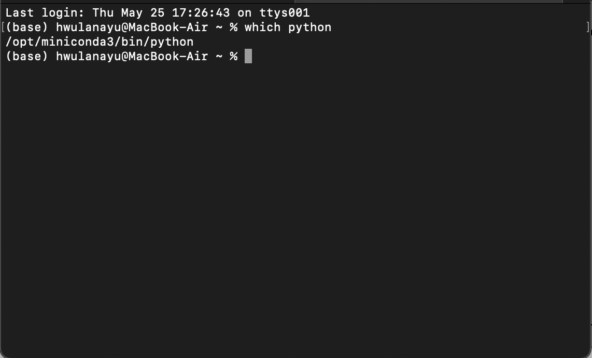
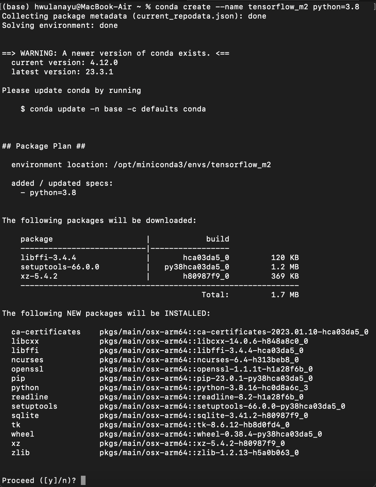
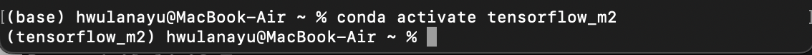
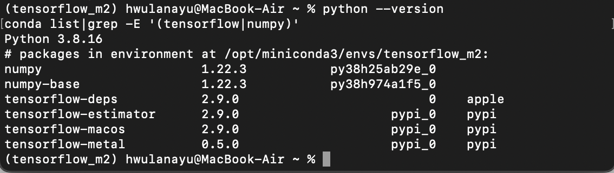
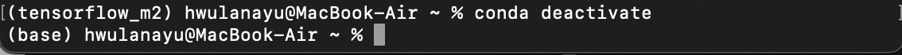
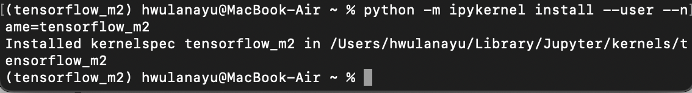
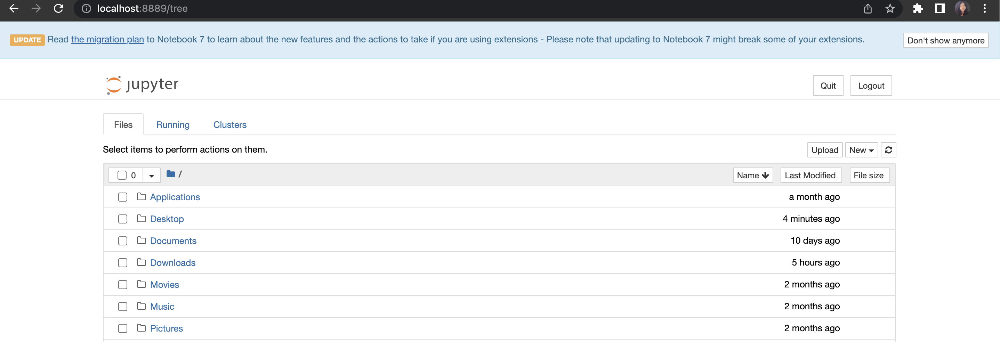
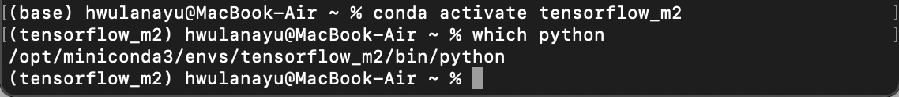
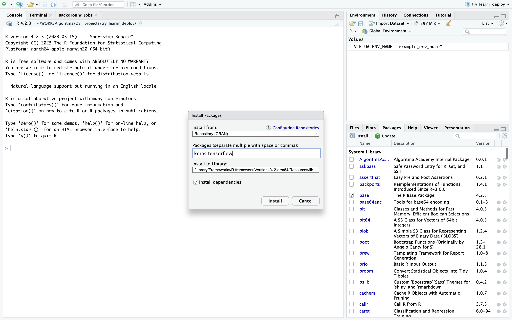
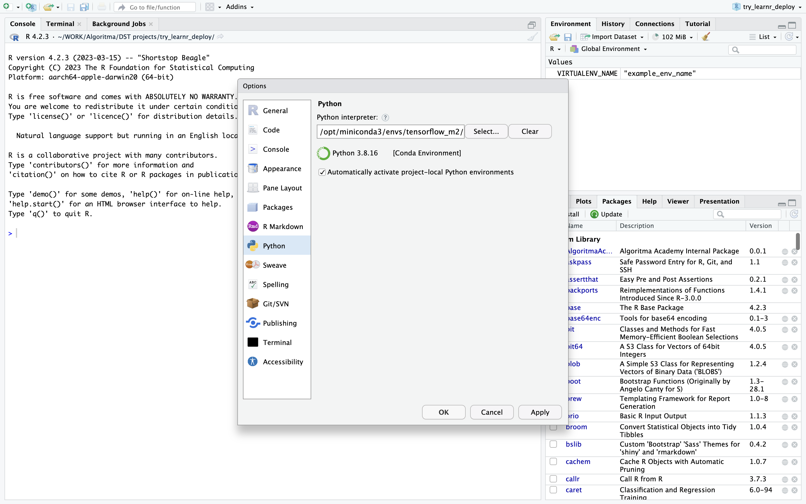

*This documentation was compiled on May 25, 2023. Please refer to the [reference link](#ref) if there is an update from the Apple Developer.*

**Contents:**

* TOC
{:toc}


# For Python Miniconda/Miniforge Environment

## 1. [Homebrew](https://brew.sh/) Installation

Make sure install the Homebrew on your mac. Open your terminal (f4 + "Terminal") and paste this command:

```
/bin/bash -c "$(curl -fsSL https://raw.githubusercontent.com/Homebrew/install/HEAD/install.sh)"
```
{: #code-example-1}

Homebrew simplifies the installation of software on Apple's operating system, macOS, as well as Linux. 

> Official Documentation: [homebrew](https://brew.sh/)

## 2. Xcode Installation

Check on your mac if Xcode Command Line already installed. If not, you can paste this command on Terminal:

```
xcode-select --install
```
Xcode Command Line Tools are an additional install which allows to compile applications from the command line (instead of using the Xcode application).

## 3. Miniforge/Miniconda Installation<a name="three"></a>

Install miniforge for arm64 (Apple Silicon). Miniforge enables installing python packages natively compiled for Apple Silicon. 

Note: If you already installed Anaconda Package Manager, uninstall it to avoid further errors. You can paste this code **one-by-one** on your Terminal:

```
conda install anaconda-clean 

anaconda-clean --yes

sudo rm -rf /anaconda3
```

Try this one if command above is not succesfull:

```
sudo rm -rf anaconda3
sudo rm -rf ~/anaconda3
sudo rm -rf ~/opt/anaconda3
```
Further reference to [uninstall Anaconda on macOS](https://docs.anaconda.com/free/anaconda/install/uninstall/#macos-or-linux)

[Install miniforge](https://docs.conda.io/en/latest/miniconda.html). Download the **Miniconda3 macOS Apple M1 64-bit pkg**.

Close your Terminal and open the new one. Make sure your miniconda installed correctly. By default, miniconda gives you `base` environment.

<p align="center" width="100%">
    
</p>

## 4. Create Virtual Environment

Create a virtual environment named `tensorflow_m2` or anything, really, with python3.8 or 3.9 or 3.10 installed.

```
conda create --name <YOUR_VIRTUAL_ENV_NAME> python=<PYTHON_VERSION>
```

Example:

```
conda create --name tensorflow_m2 python=3.8
```

<p align="center" width="100%">
    
</p>

type `y` and enter.

Activate your virtual environment with this command:

```
conda activate <YOUR_VIRTUAL_ENV_NAME>
```

example:
```
conda activate tensorflow_m2
```

<p align="center" width="100%">
    
</p>

## 5. Installing Tensorflow-MacOS libraries<a name="five"></a>

This is the crucial step especially with the library version. You have to specifically list the exact version or your tensorflow wont run correctly.

Choose one set that does not output an error:

```
conda install -c apple tensorflow-deps==2.10.0
python -m pip install tensorflow-macos==2.10.0
python -m pip install tensorflow-metal==0.6.0
```

or

```
conda install -c apple tensorflow-deps==2.9.0
python -m pip install tensorflow-macos==2.9.0
python -m pip install tensorflow-metal==0.5.0
```

After installation above, check the package/library version with this command:

```
python --version
conda list|grep -E '(tensorflow|numpy)'
```

<p align="center" width="100%">
    
</p>

Make sure there's numpy library on your environment.

## 6. Jupyter Notebook Installation

Back to your conda base environment with this command:

```
conda deactivate
```

<p align="center" width="100%">
    
</p>

Check if jupyter notebook already installed on your base env.

```
pip list
```

or

```
conda list
```

output example:

```
...
jupyter-client           7.3.4
jupyter_core             5.3.0
jupyter-events           0.6.3
jupyter-server           1.23.6
jupyter_server_terminals 0.4.4
jupyterlab-pygments      0.2.2
...
```

If jupyter notebook note installed yet, install it with this command:

```
pip install notebook
```

Now that you already have jupyter notebook on base environment, activate the virtual environment that has the `tensorflow` library installed. 

```
conda activate tensorflow_m2
```

Install ipykernel and pandas on virtual environment:

```
pip install pandas ipykernel

```

Create new kernel with this command:

```
python -m ipykernel install --user --name=<YOUR_KERNEL_NAME>
```

example:

```
python -m ipykernel install --user --name=tensorflow_m2
```

<p align="center" width="100%">
    
</p>

Back to your `base` environment and type `jupyter notebook` on your terminal. It will open a localhost browser tab.

<p align="center" width="100%">
    
</p>

Create New Notebook with the new kernel.

On upper right jupyter notebook localhost, click `New` button, select the kernel that has tensorflow installed on its environment. On your new notebook, import TensorFlow and paste this code:


```python
import tensorflow as tf
print("Num GPUs Available: ", len(tf.config.experimental.list_physical_devices('GPU')))
```

    Num GPUs Available:  1


## 7. Verify Installation

From [Official Documentation](https://developer.apple.com/metal/tensorflow-plugin/), you can verify using this simple script:


```python
import tensorflow as tf

cifar = tf.keras.datasets.cifar100
(x_train, y_train), (x_test, y_test) = cifar.load_data()
model = tf.keras.applications.ResNet50(
    include_top=True,
    weights=None,
    input_shape=(32, 32, 3),
    classes=100,)

loss_fn = tf.keras.losses.SparseCategoricalCrossentropy(from_logits=True)
model.compile(optimizer="adam", loss=loss_fn, metrics=["accuracy"])
model.fit(x_train, y_train, epochs=5, batch_size=64)
```
Expected output:

    Metal device set to: Apple M1


    2023-05-25 19:08:54.776001: I tensorflow/core/common_runtime/pluggable_device/pluggable_device_factory.cc:305] Could not identify NUMA node of platform GPU ID 0, defaulting to 0. Your kernel may not have been built with NUMA support.
    2023-05-25 19:08:54.776164: I tensorflow/core/common_runtime/pluggable_device/pluggable_device_factory.cc:271] Created TensorFlow device (/job:localhost/replica:0/task:0/device:GPU:0 with 0 MB memory) -> physical PluggableDevice (device: 0, name: METAL, pci bus id: <undefined>)


    Epoch 1/5


    2023-05-25 19:08:55.767384: W tensorflow/core/platform/profile_utils/cpu_utils.cc:128] Failed to get CPU frequency: 0 Hz
    /opt/miniconda3/envs/tensorflow_m2/lib/python3.8/site-packages/tensorflow/python/util/dispatch.py:1082: UserWarning: "`sparse_categorical_crossentropy` received `from_logits=True`, but the `output` argument was produced by a sigmoid or softmax activation and thus does not represent logits. Was this intended?"
      return dispatch_target(*args, **kwargs)
    2023-05-25 19:08:57.685235: I tensorflow/core/grappler/optimizers/custom_graph_optimizer_registry.cc:113] Plugin optimizer for device_type GPU is enabled.


    782/782 [==============================] - 127s 158ms/step - loss: 4.8612 - accuracy: 0.0606
    Epoch 2/5
    782/782 [==============================] - 122s 156ms/step - loss: 4.5699 - accuracy: 0.0862
    Epoch 3/5
    782/782 [==============================] - 122s 156ms/step - loss: 4.1519 - accuracy: 0.1116
    Epoch 4/5
    782/782 [==============================] - 122s 156ms/step - loss: 3.7930 - accuracy: 0.1513
    Epoch 5/5
    782/782 [==============================] - 123s 157ms/step - loss: 3.5854 - accuracy: 0.1827


    <keras.callbacks.History at 0x2a4d557c0>


If you can run above script successfully, congrats, you have finished the tensorflow installation! 

# For R and RStudio environment

Follow steps [**three**](#three) to step [**five**](#five) on the Python installation above. If you have done it, proceed with the steps below. Make sure the laptop has the [R programming languages](http://lib.stat.cmu.edu/R/CRAN/) and [RStudio IDE](https://posit.co/download/rstudio-desktop/) installed.

##  Edit ~/.Renviron and Find Python Virtual Env Path

On your Terminal, activate your virtual environment. Paste this command to your Terminal.

```
echo "RETICULATE_PYTHON=~/miniforge3/envs/<YOUR_ENV_NAME>/bin/python" >> ~/.Renviron
```

example:

```
echo "RETICULATE_PYTHON=~/miniforge3/envs/tensorflow_m2/bin/python" >> ~/.Renviron
```

Check your Python virtual environment path with this command:

```
which python
```

<p align="center" width="100%">
    
</p>


Copy the output path and save it somewhere. We're going to use it in RStudio.

## RStudio Settings

### `keras` and `tensorflow` Library Installation

Open RStudio, install `keras` dan `tensorflow` libraries. On lower left Panel, click `Packages` tab > Install > type the library name.

<p align="center" width="100%">
    
</p>

### Set `reticulate` environment

Open R-Studio and restart R-Session: Click menu `Session` $\rightarrow$ `Restart R`. On Console panel, run this scripts **one-by-one**:

```r
> Sys.setenv(RETICULATE_PYTHON = "<PYTHON_ENV_PATH FROM_WHICH_PYTHON_COMMAND>")
> reticulate::use_python("<PYTHON_ENV_PATH FROM_WHICH_PYTHON_COMMAND>")
> reticulate::use_condaenv("<YOUR_ENV_NAME>", required = TRUE)

> library(tensorflow)
> tf_config() 
> tf_version() 
> tf$config$list_logical_devices()
```

example:

```r
> Sys.setenv(RETICULATE_PYTHON = "/opt/miniconda3/envs/tensorflow_m2/bin/python")
> reticulate::use_python("/opt/miniconda3/envs/tensorflow_m2/bin/python")
> reticulate::use_condaenv("tensorflow_m2", required = TRUE)

> library(tensorflow)
> tf_config() 
> tf_version() 
> tf$config$list_logical_devices()
```

### Set Global Options

If there are no errors from all the line codes above, please go to menu `Tools` > `Global Options` > `Python`. In the Python Interpreter Section, remove the default path, and replace it with the Python path output from `tf_config()` above. For example, if the output looks like this:

```r
> tf_config() 
TensorFlow v2.9.0 (/opt/miniconda3/envs/tensorflow_m2/lib/python3.8/site-packages/tensorflow)
Python v3.8 (/opt/miniconda3/envs/tensorflow_m2/bin/python3.8)
```

it means that what you entered in `Global Options` is "/opt/miniconda3/envs/tensorflow_m1/bin/python3.8". (minus the quotation marks).

<p align="center" width="100%">
    
</p>


## Verify Installation
If so, try to close Rstudio and open some R project that uses TensorFlow. Run All and make sure all the code can work. Or you can verify your installation with this code:

```r
> library(keras)
> model <- keras_model_sequential()
```

The `model` variable should be appear on your global environment and if there is no error, then it is ready to use.

# References<a name="ref"></a>

## Python

- [Miniconda Official Documentation](https://docs.conda.io/en/latest/miniconda.html)
- [Prabhat Kumar Sahu's Medium blog](https://caffeinedev.medium.com/how-to-install-tensorflow-on-m1-mac-8e9b91d93706)
- [Miniforge github](https://github.com/conda-forge/miniforge)
- [Apple Developer Official Documentation](https://developer.apple.com/metal/tensorflow-plugin/)
- [Apple Developer Forum Thread](https://developer.apple.com/forums/thread/702851)
- [Stackoverflow: What is the proper way to install TensorFlow on Apple M1 in 2022](https://stackoverflow.com/questions/72964800/what-is-the-proper-way-to-install-tensorflow-on-apple-m1-in-2022)

## R

- [Stackoverflow: How to install keras using R Studio on a Mac OS computer?](https://stackoverflow.com/questions/71355902/how-to-install-keras-using-r-studio-on-a-mac-os-computer)
- [Github Discussion: Error install tensorflow di R dengan chipset m1/m2](https://github.com/teamalgoritma/community/discussions/622)
- [Stackoverflow: R (RStudio) can't find valid tensorflow installation (Mac M1)](https://stackoverflow.com/questions/74953200/r-rstudio-cant-find-valid-tensorflow-installation-mac-m1)



<script>
<!-- clipboard.js code -->
</script>


// get all <code> elements
var allCodeBlocksElements = $( "code" );

allCodeBlocksElements.each(function(i) {
 	// add different id for each code block

	// target	
  var currentId = "codeblock" + (i + 1);
  $(this).attr('id', currentId);
     
  //trigger
  var clipButton = '<button class="btn" data-clipboard-target="#' + currentId + '"></button>';
     $(this).after(clipButton);
  });
 
  new Clipboard('.btn');
    
<script src="https://code.jquery.com/jquery-3.2.1.min.js"></script>
<script src="https://cdn.jsdelivr.net/npm/clipboard@1/dist/clipboard.min.js"></script>

